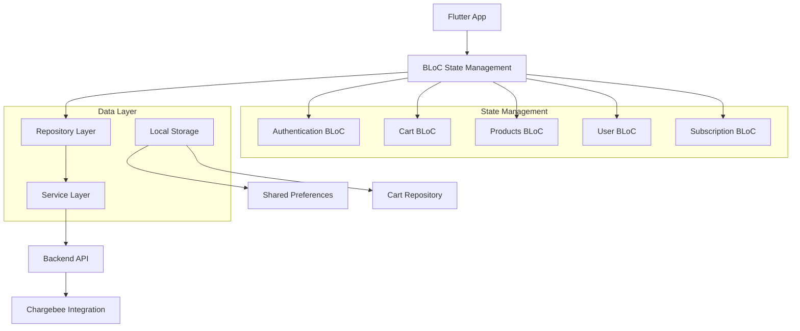
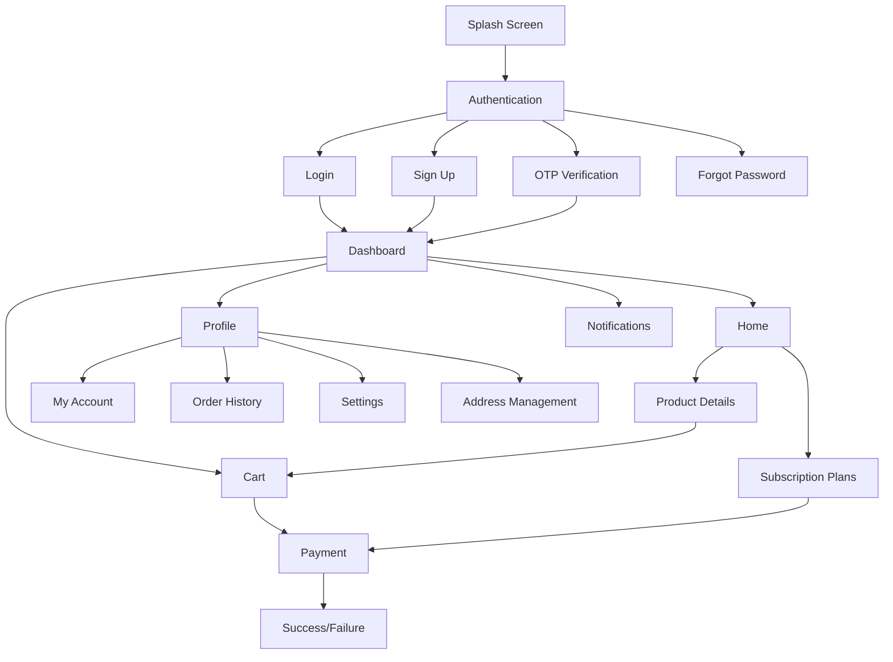
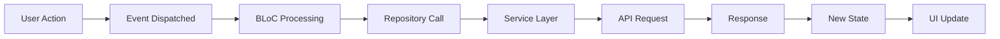

# BookMyJuice Flutter App - Frontend Documentation

## 📋 Overview

**BookMyJuice** is a Flutter mobile application that provides customers with a seamless experience to order fresh cold-pressed juices on both **subscription** and **one-time order** basis. The app features a modern UI with subscription management, cart functionality, and integrated payment processing.

### API Base URL configuration

- The app reads the backend base URL from a compile-time define: `API_BASE_URL`.
- Default (when not provided):
  - Web: `http://127.0.0.1:8080`
  - Mobile/desktop: `http://10.0.2.2:8080` (Android emulator loopback)

Run examples:

```bash
# Debug run pointing to local backend
flutter run --dart-define=API_BASE_URL=http://localhost:8080

# Widget tests with a specific backend
flutter test --dart-define=API_BASE_URL=http://localhost:8080

# Release build with staging backend
flutter build apk \
  --dart-define=API_BASE_URL=https://staging.api.bookmyjuice.co.in
```

Note on webhooks

- Chargebee webhooks cannot target `localhost`. To test webhook flows in dev, expose your backend over a public HTTPS URL (production/staging) or use a secure tunnel (e.g., ngrok/Cloudflare Tunnel) and configure Chargebee to call the tunnel URL under `/api/webhooks/**`.
- Chargebee test-hosted pages use `https://bookmyjuice-test.chargebee.com`.

### Integration tests

- Gated by a compile-time flag to avoid accidental execution.
- Example runs:

```bash
# Run integration tests on a connected device/emulator
flutter test integration_test \
  --dart-define=API_BASE_URL=http://localhost:8080 \
  --dart-define=E2E=true \
  --dart-define=E2E_USER=9876543210 \
  --dart-define=E2E_PASS=SecurePass123!

# Run in Chrome (web)
flutter test -d chrome integration_test \
  --dart-define=API_BASE_URL=http://127.0.0.1:8080 \
  --dart-define=E2E=true \
  --dart-define=E2E_USER=9876543210 \
  --dart-define=E2E_PASS=SecurePass123!
```

Validates:
- Sign-in (`/api/auth/signin`) and profile (`/api/test/user`)
- Pricing session URLs (`/api/test/generate_pricing_page_session_url`)
- One-time checkout (`/api/test/oneTimeCheckoutPageUrl`)
- Cart checkout (`/api/test/cartCheckout`)
- Self-serve portal session (`/api/test/portal`)

## 🏗️ Architecture

### App Architecture



### Technology Stack

| Component | Technology | Version |
|-----------|-----------|---------|
| **Framework** | Flutter | 3.x |
| **Language** | Dart | 3.x |
| **State Management** | BLoC Pattern | 9.0.0+ |
| **UI Design** | Material Design | 3.x |
| **HTTP Client** | HTTP Package | 1.2.1+ |
| **Screen Adaptation** | ScreenUtil | 5.9.3+ |
| **Local Storage** | Shared Preferences | 2.0.17+ |
| **Payments** | Razorpay | 1.3.0+ |

## 🎯 Core Features

### 🔐 Authentication
- **Multi-method Sign-up/Login**
  - Email/Password authentication
  - Google Sign-In integration
  - Facebook authentication
  - OTP-based mobile verification
- **Password Management**
  - Secure password validation
  - Forgot password functionality
  - Auto-login with token persistence

### 🛒 Shopping Experience
- **Product Catalog**
  - Cold-pressed juice varieties
  - Detailed product information
  - Nutritional information display
  - High-quality product images
- **Cart Management**
  - Add/remove items
  - Quantity adjustment
  - Size selection
  - Real-time price calculation
  - Persistent cart storage

### 💳 Subscription Management
- **Subscription Plans**
  - Multiple plan options (30:30, 15:30, 7:7, 1:7)
  - Plan comparison interface
  - Pricing transparency
  - Subscription lifecycle management
- **Billing Integration**
  - Chargebee hosted pages
  - Secure payment processing
  - Subscription renewal management
  - Invoice access

### 🏠 User Experience
- **Dashboard**
  - Personalized welcome interface
  - Order history tracking
  - Subscription status overview
  - Quick access to favorites
- **Profile Management**
  - Personal information management
  - Address book
  - Notification preferences
  - Account settings

## 📁 Project Structure

```
lush/
├── android/                          # Android-specific configuration
├── ios/                              # iOS-specific configuration
├── lib/                              # Main application code
│   ├── main.dart                     # App entry point
│   ├── theme.dart                    # App theme configuration
│   ├── getIt.dart                    # Dependency injection setup
│   ├── bloc/                         # BLoC state management
│   │   ├── AuthBloc/                # Authentication state
│   │   │   ├── AuthBloc.dart
│   │   │   ├── AuthEvents.dart
│   │   │   └── AuthState.dart
│   │   ├── CartBloc/                # Cart state management
│   │   │   ├── CartBloc.dart
│   │   │   ├── cartEvent.dart
│   │   │   └── cartState.dart
│   │   ├── ProductsBloc/            # Products state management
│   │   │   └── ProductsBloc.dart
│   │   ├── UserBloc/                # User state management
│   │   │   ├── UserBloc.dart
│   │   │   ├── UserEvents.dart
│   │   │   └── UserState.dart
│   │   └── SubscriptionBloc/        # Subscription state management
│   │       └── SubscriptionBloc.dart
│   ├── services/                     # Business logic services
│   │   └── JuiceService.dart        # Juice data service
│   ├── CartRepository/              # Cart data management
│   │   └── cartRepository.dart
│   ├── UserRepository/              # User data management
│   │   └── userRepository.dart
│   └── views/                       # UI components
│       ├── all_Screens.dart         # Screen exports
│       ├── Weekdays.dart            # Weekday utilities
│       ├── extensions/              # Theme extensions
│       │   └── theme_extensions.dart
│       ├── models/                  # Data models
│       │   ├── address.dart
│       │   ├── cart.dart
│       │   ├── CartItem.dart
│       │   ├── contact.dart
│       │   ├── DetailedJuiceCard.dart
│       │   ├── DynamicJuice.dart
│       │   ├── Facebook.dart
│       │   ├── googleSignIn.dart
│       │   ├── Item.dart
│       │   ├── Juice.dart
│       │   ├── JuiceListView.dart
│       │   ├── JuicesView.dart
│       │   ├── JuiceTestPage.dart
│       │   ├── model.dart
│       │   ├── Plan.dart
│       │   ├── PlanService.dart
│       │   ├── SignupRequest.dart
│       │   ├── SubcriptionView.dart
│       │   ├── subscriptionPlan.dart
│       │   ├── title_view.dart
│       │   └── user.dart
│       ├── screens/                 # App screens
│       │   ├── AddressScreen.dart
│       │   ├── CartScreen.dart
│       │   ├── Dashboard.dart
│       │   ├── detail.dart
│       │   ├── EnterMobileNumber.dart
│       │   ├── ForgotPasswordPage.dart
│       │   ├── HomePage.dart
│       │   ├── loginPage.dart
│       │   ├── Menu.dart
│       │   ├── MyAccountPage.dart
│       │   ├── notifications.dart
│       │   ├── OrderHistoryPage.dart
│       │   ├── OTPloginPage.dart
│       │   ├── paymentScreen.dart
│       │   ├── PlanSelectionScreen.dart
│       │   ├── SettingsPage.dart
│       │   ├── SignUpScreen.dart
│       │   ├── SplashPage.dart
│       │   └── SubscriptionScreen.dart
│       └── widgets/                 # Reusable UI components
│           ├── app_card.dart
│           ├── cart_icon.dart
│           ├── dashboard_components.dart
│           ├── size_selection_modal.dart
│           └── welcome_header.dart
├── assets/                          # App assets
│   ├── images/                      # Product images
│   └── icons/                       # App icons
├── test/                           # Test files
├── pubspec.yaml                    # Dependencies configuration
└── README.md                       # This documentation
```

## 🎨 UI/UX Design

### Design System

#### Color Palette
```dart
class LushTheme {
  static const Color nearlyWhite = Color(0xFFFEFEFE);
  static const Color white = Color(0xFFFFFFFF);
  static const Color nearlyBlack = Color(0xFF213333);
  static const Color grey = Color(0xFF3A5160);
  static const Color darkGrey = Color(0xFF313A44);
  static const Color darkerText = Color(0xFF17262A);
  static const Color lightText = Color(0xFF4A6572);
  static const Color nearlyBlue = Color(0xFF00B6F0);
  static const Color deactivatedText = Color(0xFF767676);
  static const Color dismissibleBackground = Color(0xFF364A54);
}
```

#### Typography
- **Primary Font**: Google Fonts integration
- **Font Weights**: Regular, Medium, Bold
- **Responsive Text**: ScreenUtil for consistent sizing across devices

#### Components
- **AppCard**: Consistent card design with shadows and rounded corners
- **AppCardHeader**: Standardized header component with titles and actions
- **AppLoadingCard**: Animated loading states with shimmer effect

### Screen Hierarchy



## 🔄 State Management

### BLoC Pattern Implementation

#### Authentication BLoC
```dart
// Authentication Events
abstract class AuthenticationEvent extends Equatable {}

class AutoLogIn extends AuthenticationEvent {}
class LogInUser extends AuthenticationEvent {}
class SignUpUser extends AuthenticationEvent {}
class LogOutUser extends AuthenticationEvent {}

// Authentication States
abstract class AuthenticationState extends Equatable {}

class AuthenticationInProgress extends AuthenticationState {}
class AuthenticationSuccess extends AuthenticationState {}
class AuthenticationFailure extends AuthenticationState {}
class AutoLoginFailed extends AuthenticationState {}
```

#### Cart BLoC
```dart
// Cart Events
abstract class CartEvent extends Equatable {}

class AddToCart extends CartEvent {}
class RemoveFromCart extends CartEvent {}
class UpdateQuantity extends CartEvent {}
class ClearCart extends CartEvent {}

// Cart States
abstract class CartState extends Equatable {}

class CartInitial extends CartState {}
class CartLoading extends CartState {}
class CartLoaded extends CartState {}
class CartError extends CartState {}
```

### State Flow Diagram



## 📱 Screen Details

### 🏠 Dashboard Screen
- **Welcome Header**: Personalized greeting with user name
- **Featured Products**: Horizontal scrolling juice cards
- **Quick Actions**: Direct access to cart, subscriptions, and profile
- **Order Status**: Current order tracking information

### 🛒 Cart Screen
- **Item List**: Detailed cart items with images and descriptions
- **Quantity Controls**: Increment/decrement buttons
- **Price Calculation**: Real-time total calculation
- **Checkout Button**: Direct payment processing

### 💳 Subscription Screen
- **Plan Comparison**: Side-by-side plan features
- **Pricing Display**: Clear pricing with billing cycles
- **Selection Interface**: Easy plan selection with visual feedback
- **Chargebee Integration**: Hosted page integration for payments

### 👤 Profile Screen
- **Account Information**: Personal details management
- **Order History**: Past orders with status tracking
- **Address Management**: Multiple address support
- **Settings**: App preferences and notification settings

## 🔐 Security Features

### Authentication Security
- **JWT Token Management**: Secure token storage and refresh
- **Biometric Authentication**: Optional fingerprint/face ID
- **Session Management**: Automatic logout on token expiry
- **Password Validation**: Strong password requirements

### Data Security
- **Local Storage Encryption**: Sensitive data encryption
- **API Communication**: HTTPS only communication
- **Input Validation**: Client-side validation for all forms
- **Error Handling**: Secure error messages without sensitive data

## 🚀 Performance Optimizations

### Loading Strategies
- **Lazy Loading**: On-demand screen loading
- **Image Caching**: Cached network images for better performance
- **Shimmer Loading**: Smooth loading animations
- **Pagination**: Efficient data loading for large lists

### Memory Management
- **BLoC Disposal**: Proper cleanup of BLoC instances
- **Image Optimization**: Optimized image sizes and formats
- **Memory Monitoring**: Debugging tools for memory usage
- **Widget Optimization**: Efficient widget rebuilding

## 🧪 Testing Strategy

### Test Structure
```
test/
├── unit/                    # Unit tests
│   ├── bloc/               # BLoC tests
│   ├── models/             # Model tests
│   ├── services/           # Service tests
│   └── repositories/       # Repository tests
├── widget/                 # Widget tests
│   ├── screens/            # Screen tests
│   └── widgets/            # Component tests
└── integration/            # Integration tests
    ├── auth_flow/          # Authentication flow tests
    ├── cart_flow/          # Cart functionality tests
    └── subscription_flow/  # Subscription flow tests
```

### Testing Tools
- **Unit Testing**: Built-in Dart testing framework
- **Widget Testing**: Flutter widget testing
- **Integration Testing**: End-to-end testing
- **Mock Testing**: Mockito for mocking dependencies

## 📡 API Integration

### Backend Communication
The Flutter app communicates with the Spring Boot backend through RESTful APIs. All API calls are handled through repository classes that manage HTTP requests and responses.

### Base Configuration
```dart
class ApiConfig {
  static const String baseUrl = 'http://api.bookmyjuice.co.in:8080';
  static const Duration timeout = Duration(seconds: 30);
  
  // API Endpoints
  static const String authSignIn = '/api/auth/signin';
  static const String authSignUp = '/api/auth/signup';
  static const String authAutoLogin = '/api/auth/autologin';
  static const String authResetPassword = '/api/auth/resetpassword';
  static const String userProfile = '/api/test/user';
  static const String chargeItems = '/api/test/charge-items';
  static const String pricingPage = '/api/test/generate_pricing_page_session_url';
  static const String selfServePortal = '/api/test/portal';
  static const String oneTimeCheckout = '/api/test/oneTimeCheckoutPageUrl';
  static const String cartCheckout = '/api/test/cartCheckout';
}
```

---

## 🔐 Authentication API Integration

### UserRepository Authentication Methods

#### 1. User Login
```dart
Future<bool> login(String username, String password, bool remember) async {
  final response = await http.post(
    Uri.parse('${ApiConfig.baseUrl}${ApiConfig.authSignIn}'),
    body: jsonEncode({
      "username": username,
      "password": password
    }),
    headers: {
      "Accept": "application/json",
      "Content-Type": "application/json",
    }
  );
  
  if (response.statusCode == 200) {
    final responseData = json.decode(response.body);
    final token = responseData['accessToken'];
    
    // Store token for future requests
    SharedPreferences prefs = await SharedPreferences.getInstance();
    await prefs.setString("token", token);
    
    if (remember) {
      await prefs.setString("username", username);
      await prefs.setString("password", password);
    }
    
    return true;
  }
  return false;
}
```

#### 2. User Registration
```dart
Future<bool> signUp(SignUpRequest signUpRequest) async {
  final response = await http.post(
    Uri.parse('${ApiConfig.baseUrl}${ApiConfig.authSignUp}'),
    body: jsonEncode(signUpRequest.toJson()),
    headers: {
      "Accept": "application/json",
      "Content-Type": "application/json",
    }
  );
  
  if (response.statusCode == 200) {
    final responseData = json.decode(response.body);
    // User ID returned as message
    final userId = responseData['message'];
    return true;
  }
  return false;
}
```

#### 3. Auto Login
```dart
Future<bool> autoLogin() async {
  SharedPreferences prefs = await SharedPreferences.getInstance();
  final token = prefs.getString("token");
  
  if (token == null) return false;
  
  final response = await http.get(
    Uri.parse('${ApiConfig.baseUrl}${ApiConfig.authAutoLogin}'),
    headers: {
      "Authorization": "Bearer $token",
      "Accept": "application/json",
      "Content-Type": "application/json",
    }
  );
  
  if (response.statusCode == 200) {
    final responseData = json.decode(response.body);
    return responseData['message'] == 'ok';
  }
  return false;
}
```

---

## 🛒 Product & Menu API Integration

### Get Available Products
```dart
Future<List<Product>> getChargeItems() async {
  final response = await http.get(
    Uri.parse('${ApiConfig.baseUrl}${ApiConfig.chargeItems}'),
    headers: {
      "Accept": "application/json",
      "Content-Type": "application/json",
    }
  );
  
  if (response.statusCode == 200) {
    final List<dynamic> data = json.decode(response.body);
    return data.map((item) => Product.fromJson(item)).toList();
  }
  throw Exception('Failed to load products');
}
```

### Product Model
```dart
class Product {
  final String id;
  final String name;
  final String description;
  final String type;
  final String status;
  final String unit;
  final String itemFamilyId;
  final bool enabledInPortal;
  final bool enabledForCheckout;
  final Map<String, dynamic>? metadata;
  final List<ItemPrice> itemPrices;

  Product({
    required this.id,
    required this.name,
    required this.description,
    required this.type,
    required this.status,
    required this.unit,
    required this.itemFamilyId,
    required this.enabledInPortal,
    required this.enabledForCheckout,
    this.metadata,
    required this.itemPrices,
  });

  factory Product.fromJson(Map<String, dynamic> json) {
    return Product(
      id: json['id'],
      name: json['name'],
      description: json['description'] ?? '',
      type: json['type'],
      status: json['status'],
      unit: json['unit'] ?? '',
      itemFamilyId: json['itemFamilyId'] ?? '',
      enabledInPortal: json['enabledInPortal'] ?? true,
      enabledForCheckout: json['enabledForCheckout'] ?? true,
      metadata: json['metadata'],
      itemPrices: (json['itemPrices'] as List?)
          ?.map((price) => ItemPrice.fromJson(price))
          .toList() ?? [],
    );
  }
}

class ItemPrice {
  final String id;
  final String name;
  final String currencyCode;
  final double price;
  final int? period;
  final String? periodUnit;
  final String status;

  ItemPrice({
    required this.id,
    required this.name,
    required this.currencyCode,
    required this.price,
    this.period,
    this.periodUnit,
    required this.status,
  });

  factory ItemPrice.fromJson(Map<String, dynamic> json) {
    return ItemPrice(
      id: json['id'],
      name: json['name'],
      currencyCode: json['currencyCode'],
      price: (json['price'] as num).toDouble(),
      period: json['period'],
      periodUnit: json['periodUnit'],
      status: json['status'],
    );
  }
}
```

---

## 💳 Subscription API Integration

### Get Subscription Page URLs
```dart
Future<Map<String, String>> getSubscriptionPageUrl() async {
  SharedPreferences prefs = await SharedPreferences.getInstance();
  final token = prefs.getString("token");
  
  final response = await http.get(
    Uri.parse('${ApiConfig.baseUrl}${ApiConfig.pricingPage}'),
    headers: {
      "Authorization": "Bearer $token",
      "Accept": "application/json",
      "Content-Type": "application/json",
    }
  );
  
  if (response.statusCode == 200) {
    final Map<String, dynamic> data = json.decode(response.body);
    return {
      "premium": data['premium']['url'],
      "signature": data['signature']['url'],
      "delight": data['delight']['url'],
    };
  }
  throw Exception('Failed to load subscription URLs');
}
```

### Self-Serve Portal Integration
```dart
Future<String> getSelfServePortalUrl() async {
  SharedPreferences prefs = await SharedPreferences.getInstance();
  final token = prefs.getString("token");
  
  final response = await http.get(
    Uri.parse('${ApiConfig.baseUrl}${ApiConfig.selfServePortal}'),
    headers: {
      "Authorization": "Bearer $token",
      "Accept": "application/json",
      "Content-Type": "application/json",
    }
  );
  
  if (response.statusCode == 200) {
    final Map<String, dynamic> data = json.decode(response.body);
    return data['access_url'];
  }
  throw Exception('Failed to load portal URL');
}
```

---

## 🛍️ Checkout API Integration

### One-Time Checkout
```dart
Future<String> getOneTimeCheckoutUrl() async {
  SharedPreferences prefs = await SharedPreferences.getInstance();
  final token = prefs.getString("token");
  
  final response = await http.get(
    Uri.parse('${ApiConfig.baseUrl}${ApiConfig.oneTimeCheckout}'),
    headers: {
      "Authorization": "Bearer $token",
      "Accept": "application/json",
      "Content-Type": "application/json",
    }
  );
  
  if (response.statusCode == 200) {
    final Map<String, dynamic> data = json.decode(response.body);
    return data['url'];
  }
  throw Exception('Failed to load checkout URL');
}
```

### Cart Checkout
```dart
Future<String> getCartCheckoutUrl() async {
  SharedPreferences prefs = await SharedPreferences.getInstance();
  final token = prefs.getString("token");
  
  final response = await http.get(
    Uri.parse('${ApiConfig.baseUrl}${ApiConfig.cartCheckout}'),
    headers: {
      "Authorization": "Bearer $token",
      "Accept": "application/json",
      "Content-Type": "application/json",
    }
  );
  
  if (response.statusCode == 200) {
    final Map<String, dynamic> data = json.decode(response.body);
    return data['url'];
  }
  throw Exception('Failed to load cart checkout URL');
}
```

---

## 👤 User Profile API Integration

### Get User Profile
```dart
Future<User> getUserProfile() async {
  SharedPreferences prefs = await SharedPreferences.getInstance();
  final token = prefs.getString("token");
  
  final response = await http.get(
    Uri.parse('${ApiConfig.baseUrl}${ApiConfig.userProfile}'),
    headers: {
      "Authorization": "Bearer $token",
      "Accept": "application/json",
      "Content-Type": "application/json",
    }
  );
  
  if (response.statusCode == 200) {
    final Map<String, dynamic> data = json.decode(response.body);
    return User.fromJson(data);
  }
  throw Exception('Failed to load user profile');
}
```

---

## 🔄 BLoC State Management with API Integration

### AuthBloc with API Integration
```dart
class AuthBloc extends Bloc<AuthenticationEvent, AuthenticationState> {
  final UserRepository userRepository;

  AuthBloc({required this.userRepository}) : super(AuthenticationInitial()) {
    on<LogInUser>(_onLogInUser);
    on<SignUpUser>(_onSignUpUser);
    on<AutoLogIn>(_onAutoLogIn);
    on<LogOutUser>(_onLogOutUser);
  }

  Future<void> _onLogInUser(
    LogInUser event,
    Emitter<AuthenticationState> emit,
  ) async {
    emit(AuthenticationInProgress());
    
    try {
      final success = await userRepository.login(
        event.username,
        event.password,
        event.remember,
      );
      
      if (success) {
        emit(AuthenticationSuccess());
      } else {
        emit(AuthenticationFailure(error: 'Invalid credentials'));
      }
    } catch (e) {
      emit(AuthenticationFailure(error: e.toString()));
    }
  }

  Future<void> _onAutoLogIn(
    AutoLogIn event,
    Emitter<AuthenticationState> emit,
  ) async {
    emit(AuthenticationInProgress());
    
    try {
      final success = await userRepository.autoLogin();
      
      if (success) {
        emit(AuthenticationSuccess());
      } else {
        emit(AutoLoginFailed());
      }
    } catch (e) {
      emit(AuthenticationFailure(error: e.toString()));
    }
  }
}
```

### CartBloc with API Integration
```dart
class CartBloc extends Bloc<CartEvent, CartState> {
  final CartRepository cartRepository;
  final UserRepository userRepository;

  CartBloc({
    required this.cartRepository,
    required this.userRepository,
  }) : super(CartInitial()) {
    on<LoadCart>(_onLoadCart);
    on<AddToCart>(_onAddToCart);
    on<RemoveFromCart>(_onRemoveFromCart);
    on<CheckoutCart>(_onCheckoutCart);
  }

  Future<void> _onCheckoutCart(
    CheckoutCart event,
    Emitter<CartState> emit,
  ) async {
    emit(CartLoading());
    
    try {
      final checkoutUrl = await userRepository.getCartCheckoutUrl();
      emit(CartCheckoutReady(checkoutUrl: checkoutUrl));
    } catch (e) {
      emit(CartError(error: e.toString()));
    }
  }
}
```

---

## 🔒 Security Implementation

### JWT Token Management
```dart
class TokenManager {
  static const String _tokenKey = 'jwt_token';
  static const String _refreshTokenKey = 'refresh_token';
  
  static Future<void> saveToken(String token) async {
    final prefs = await SharedPreferences.getInstance();
    await prefs.setString(_tokenKey, token);
  }
  
  static Future<String?> getToken() async {
    final prefs = await SharedPreferences.getInstance();
    return prefs.getString(_tokenKey);
  }
  
  static Future<void> clearTokens() async {
    final prefs = await SharedPreferences.getInstance();
    await prefs.remove(_tokenKey);
    await prefs.remove(_refreshTokenKey);
  }
  
  static Future<bool> isTokenValid() async {
    final token = await getToken();
    if (token == null) return false;
    
    try {
      // Decode JWT and check expiry
      final parts = token.split('.');
      if (parts.length != 3) return false;
      
      final payload = json.decode(
        utf8.decode(base64Url.decode(base64Url.normalize(parts[1])))
      );
      
      final exp = payload['exp'] as int;
      final now = DateTime.now().millisecondsSinceEpoch ~/ 1000;
      
      return exp > now;
    } catch (e) {
      return false;
    }
  }
}
```

### HTTP Interceptor for Authentication
```dart
class AuthenticatedHttpClient {
  static final HttpClient _httpClient = HttpClient();
  static late IOClient _ioClient;
  
  static void initialize() {
    _httpClient.badCertificateCallback = 
        (X509Certificate cert, String host, int port) => true;
    _ioClient = IOClient(_httpClient);
  }
  
  static Future<http.Response> get(String url) async {
    final token = await TokenManager.getToken();
    
    return await _ioClient.get(
      Uri.parse(url),
      headers: {
        'Authorization': 'Bearer $token',
        'Accept': 'application/json',
        'Content-Type': 'application/json',
      },
    );
  }
  
  static Future<http.Response> post(String url, {Object? body}) async {
    final token = await TokenManager.getToken();
    
    return await _ioClient.post(
      Uri.parse(url),
      body: body,
      headers: {
        'Authorization': 'Bearer $token',
        'Accept': 'application/json',
        'Content-Type': 'application/json',
      },
    );
  }
}
```

---

## 📦 Dependencies

### Core Dependencies
```yaml
dependencies:
  flutter: sdk: flutter
  bloc: ^9.0.0                    # State management
  flutter_bloc: ^9.0.0           # Flutter BLoC implementation
  equatable: ^2.0.5              # Value equality
  http: ^1.2.1                   # HTTP client
  shared_preferences: ^2.0.17    # Local storage
  flutter_screenutil: ^5.9.3     # Screen adaptation
  get_it: ^8.0.0                 # Dependency injection
```

### UI Dependencies
```yaml
dependencies:
  google_fonts: ^6.2.1           # Typography
  cached_network_image: ^3.4.1   # Image caching
  shimmer: ^3.0.0                # Loading animations
  carousel_slider: ^5.0.0        # Image carousels
  toggle_switch: ^2.3.0          # Switch controls
  url_launcher: ^6.2.5           # External URL launching
```

### Authentication Dependencies
```yaml
dependencies:
  google_sign_in: ^6.2.2         # Google authentication
  flutter_facebook_auth: ^7.0.1  # Facebook authentication
  flutter_pw_validator: ^1.5.0   # Password validation
  pin_input_text_field: ^4.2.0   # OTP input
```

### Payment Dependencies
```yaml
dependencies:
  razorpay_flutter: ^1.3.0       # Payment processing
  webview_flutter: ^4.10.0       # WebView for hosted pages
  url_launcher: ^6.3.1           # URL handling
```

## 🔧 Configuration

### Environment Setup
```dart
// Development configuration
const String baseUrl = 'http://localhost:8080';
const String apiVersion = 'v1';

// Production configuration
const String baseUrl = 'https://api.bookmyjuice.com';
const String apiVersion = 'v1';
```

### API Configuration
```dart
class ApiConfig {
  static const String baseUrl = 'your-api-base-url';
  static const Duration timeout = Duration(seconds: 30);
  static const Map<String, String> headers = {
    'Content-Type': 'application/json',
    'Accept': 'application/json',
  };
}
```

## 🚀 Getting Started

### Prerequisites
- Flutter SDK 3.0+
- Dart SDK 3.0+
- Android Studio / VS Code
- Android SDK / Xcode (for iOS)

### Installation
```bash
# Clone the repository
git clone <repository-url>
cd lush

# Install dependencies
flutter pub get

# Run the app
flutter run
```

### Build Commands
```bash
# Debug build
flutter build apk --debug

# Release build
flutter build apk --release

# iOS build
flutter build ios --release
```

## 🔄 API Integration

### HTTP Service
```dart
class HttpService {
  static Future<Response> get(String endpoint) async {
    final response = await http.get(
      Uri.parse('$baseUrl$endpoint'),
      headers: await _getHeaders(),
    );
    return _handleResponse(response);
  }
  
  static Future<Response> post(String endpoint, dynamic data) async {
    final response = await http.post(
      Uri.parse('$baseUrl$endpoint'),
      headers: await _getHeaders(),
      body: json.encode(data),
    );
    return _handleResponse(response);
  }
}
```

### Authentication Service
```dart
class AuthService {
  static Future<AuthResponse> login(String email, String password) async {
    final response = await HttpService.post('/auth/signin', {
      'email': email,
      'password': password,
    });
    return AuthResponse.fromJson(response.data);
  }
  
  static Future<AuthResponse> register(SignupRequest request) async {
    final response = await HttpService.post('/auth/signup', request.toJson());
    return AuthResponse.fromJson(response.data);
  }
}
```

## 📊 Analytics & Monitoring

### Performance Monitoring
- **Crash Reporting**: Firebase Crashlytics integration
- **Performance Metrics**: App startup time, screen load times
- **User Analytics**: User behavior tracking
- **Error Monitoring**: Real-time error tracking

### Key Metrics
- **User Engagement**: Session duration, screen views
- **Conversion Rates**: Sign-up to subscription conversion
- **Cart Abandonment**: Cart addition to purchase completion
- **App Performance**: Memory usage, CPU usage, network calls

## 🌟 Future Enhancements

### Planned Features
- **Push Notifications**: Real-time order updates
- **Social Sharing**: Share favorite juices with friends
- **Loyalty Program**: Points-based rewards system
- **Offline Mode**: Limited functionality without internet
- **Dark Mode**: Alternative theme support

### Technical Improvements
- **Code Generation**: Automated model generation
- **Automated Testing**: Comprehensive test coverage
- **CI/CD Pipeline**: Automated build and deployment
- **Performance Optimization**: Further performance enhancements

## 📞 Support

### Development Team
- **Frontend Lead**: [Contact Information]
- **UI/UX Designer**: [Contact Information]
- **QA Engineer**: [Contact Information]

### Documentation
- **API Documentation**: Available at backend server
- **Design System**: Available in design team resources
- **User Guide**: Available in app help section

---

## 📝 Version History

| Version | Date | Changes |
|---------|------|---------|
| 1.0.0 | 2024-01-15 | Initial release with core features |
| 1.1.0 | 2024-02-01 | Enhanced cart functionality |
| 1.2.0 | 2024-02-15 | Added subscription management |

---

*Last Updated: January 2024*
*This documentation is maintained by the BookMyJuice frontend development team.*
