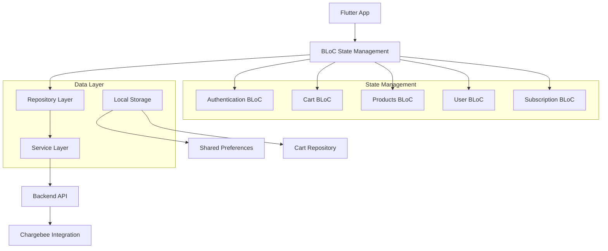

# BookMyJuice Flutter App - Complete Documentation

## 📋 Overview

**BookMyJuice** is a Flutter mobile application that provides customers with a seamless experience to order fresh cold-pressed juices on both **subscription** and **one-time order** basis. The app features a modern UI with subscription management, cart functionality, and integrated payment processing.

---

## 🏗️ Architecture

### App Architecture



### Technology Stack

| Component | Technology | Version |
|-----------|-----------|---------|
| **Framework** | Flutter | 3.x+ |
| **State Management** | BLoC | 8.x+ |
| **UI Framework** | Material Design 3 | Latest |
| **Local Storage** | Shared Preferences | Latest |
| **HTTP Client** | HTTP/Dio | Latest |
| **Payment** | Chargebee Integration | 3.x+ |
| **Authentication** | JWT | Latest |

---

## 📁 Project Structure

```
lush/
├── lib/
│   ├── bloc/                      # State management
│   │   ├── AuthBloc/             # Authentication state
│   │   ├── CartBloc/             # Shopping cart state
│   │   ├── ProductBloc/          # Product management
│   │   └── SubscriptionBloc/     # Subscription state
│   ├── services/                 # API and utility services
│   │   ├── auth_service.dart
│   │   ├── order_service.dart
│   │   ├── invoice_service.dart
│   │   └── subscription_service.dart
│   ├── views/                    # UI screens and widgets
│   │   ├── screens/
│   │   │   ├── EnterMobileNumber.dart
│   │   │   ├── OTPSignUpScreen.dart
│   │   │   ├── loginPage.dart
│   │   │   └── CartScreen.dart
│   │   └── widgets/
│   ├── config/
│   │   └── api_config.dart       # API URL configuration
│   ├── models/                   # Data models
│   ├── repositories/             # Data repositories
│   └── main.dart                 # App entry point
├── pubspec.yaml                  # Dependencies
├── android/                      # Android-specific code
├── ios/                          # iOS-specific code
└── test/                         # Unit and widget tests
```

---

## 🎯 Core Features

### 1. 🔐 Authentication
- Mobile number-based signup with OTP verification
- JWT token-based authentication
- Secure password management
- Auto-login capability
- Session management with refresh tokens

### 2. 🛒 Shopping Cart
- **Enhanced Juice Comparison Logic**: Multi-field comparison for accurate item tracking
- **Unique Item Identification**: Each juice tracked separately by ID, name, and image
- **Quantity Management**: Increase/decrease quantities easily
- **Real-time UI Updates**: Cart badge and buttons update immediately
- **Persistent Storage**: Cart data survives app restarts

### 3. 💳 Subscription Management
- View available subscription plans
- Create and manage subscriptions
- Pause/resume functionality
- Billing cycle tracking
- Invoice access

### 4. 🛍️ One-Time Orders
- Browse and order individual juices
- Flexible quantity selection
- Checkout with payment integration
- Order tracking

### 5. 📱 User Profile
- Personal information management
- Address management
- Payment methods
- Order history
- Subscription status

---

## 🔌 API Configuration

The app connects to the backend via a configurable API base URL.

### Configuration Priority
1. **Runtime Define** (Highest priority): `--dart-define=API_BASE_URL=...`
2. **Platform-specific defaults** (Fallback):
   - Web: `http://127.0.0.1:8080`
   - Mobile: `http://10.0.2.2:8080` (Android emulator)

### API Base URL Configuration

**File**: `lib/config/api_config.dart`

```dart
const String _envApiBaseUrl =
    String.fromEnvironment('API_BASE_URL', defaultValue: '');

class ApiConfig {
  static String get baseUrl {
    if (_envApiBaseUrl.isNotEmpty) return _envApiBaseUrl;
    
    if (kIsWeb) {
      return 'http://127.0.0.1:8080';
    }
    
    return 'http://192.168.1.8:8080'; // For physical devices on local network
  }
}
```

### Run Examples

```bash
# Debug run with local backend
flutter run --dart-define=API_BASE_URL=http://localhost:8080

# Release APK with specific backend
flutter build apk --release \
  --dart-define=API_BASE_URL=https://api.bookmyjuice.co.in

# Emulator with host machine IP
flutter run --dart-define=API_BASE_URL=http://10.0.2.2:8080

# Physical device on local network
flutter run --dart-define=API_BASE_URL=http://192.168.1.8:8080
```

### Webhook Testing Note
- Chargebee webhooks cannot target `localhost`
- For dev testing: Use public HTTPS URL (production/staging) or secure tunnel (ngrok/Cloudflare Tunnel)
- Configure Chargebee to call the tunnel URL under `/api/webhooks/**`
- Chargebee test-hosted pages: `https://bookmyjuice-test.chargebee.com`

---

## 🧪 Testing

### Integration Tests

Integration tests validate end-to-end flows with the backend.

**Gating**: Tests are gated by compile-time flag to prevent accidental execution.

**Example Run**:

```bash
flutter test integration_test \
  --dart-define=API_BASE_URL=http://localhost:8080 \
  --dart-define=E2E=true \
  --dart-define=E2E_USER=9876543210 \
  --dart-define=E2E_PASS=SecurePass123!
```

**What's Validated**:
- Sign-in (`/api/auth/signin`) and profile (`/api/test/user`)
- Pricing session URLs (`/api/test/generate_pricing_page_session_url`)
- One-time checkout (`/api/test/oneTimeCheckoutPageUrl`)
- Cart checkout (`/api/test/cartCheckout`)
- Self-serve portal (`/api/test/portal`)

### Unit Tests

```bash
flutter test
```

### Widget Tests

```bash
flutter test --dart-define=API_BASE_URL=http://localhost:8080
```

---

## 🚀 Building and Deployment

### Build Debug APK

```bash
cd lush/
flutter build apk --debug
```

**Output**: `build/app/outputs/flutter-apk/app-debug.apk`

### Build Release APK

```bash
flutter build apk --release --dart-define=API_BASE_URL=https://api.bookmyjuice.co.in
```

**Output**: `build/app/outputs/flutter-apk/app-release.apk`

### Build Split APKs (Smaller File Sizes)

```bash
flutter build apk --split-per-abi --release
```

**Output**:
- `app-armeabi-v7a-release.apk`
- `app-arm64-v8a-release.apk`
- `app-x86-release.apk`

### Build AAB (Google Play Store)

```bash
flutter build appbundle --release --dart-define=API_BASE_URL=https://api.bookmyjuice.co.in
```

**Output**: `build/app/outputs/bundle/release/app-release.aab`

---

## 📝 Feature Documentation

### 1. Cart Implementation

**File**: `lib/bloc/CartBloc/` | `lib/repositories/cartRepository.dart`

The cart system uses enhanced comparison logic to track items accurately:

```dart
bool _isSameJuice(Juice juice1, Juice juice2) {
  return juice1.juiceID == juice2.juiceID && 
         juice1.titleTxt == juice2.titleTxt && 
         juice1.imagePath == juice2.imagePath;
}
```

**Features**:
- ✅ **Unique Item Identification**: Multi-field comparison
- ✅ **Quantity Management**: Increase/decrease operations
- ✅ **Persistent Storage**: SharedPreferences integration
- ✅ **Real-time Updates**: BLoC state notifications
- ✅ **Error Handling**: Graceful fallbacks

**How Items Are Tracked**:
1. User taps "Add" on a juice → System checks if it already exists
2. If exists: Quantity increases | If new: Added to cart
3. Cart badge updates with total count
4. Button switches to quantity controls

### 2. OTP-Based Authentication

**Files**: 
- `lib/views/screens/EnterMobileNumber.dart`
- `lib/views/screens/OTPSignUpScreen.dart`
- `lib/bloc/AuthBloc/AuthBloc.dart`

**Flow**:
1. User enters 10-digit mobile number
2. App sends OTP request to backend
3. Waits for `OTPSent` state before navigating
4. Displays OTP verification screen
5. User enters 6-digit OTP
6. App verifies and completes signup

**Key States**:
- `OTPSent`: OTP sent successfully
- `OTPVerificationSuccess`: User verified
- `OTPVerificationFailed`: Verification error
- `OTPSendFailed`: Failed to send OTP

**Error Handling**:
- Toast notifications for failures
- Automatic error message display
- Resend OTP with countdown timer
- Connection timeout handling

### 3. Localization & Internationalization

**Files**: 
- `lib/utils/font_utils.dart`
- `lib/utils/text_utils.dart`
- `lib/main.dart`

**Features**:
- ✅ English-only text rendering
- ✅ Consistent font family (Roboto)
- ✅ Locale-specific formatting
- ✅ No Chinese characters
- ✅ Proper text sanitization

**Text Utilities**:
```dart
// Headings
FontUtils.heading1()
TextUtils.headingText("Title")

// Body text
FontUtils.bodyText()
TextUtils.bodyText("Content")

// Buttons
FontUtils.buttonText()
TextUtils.buttonText("Click me")

// Hints
FontUtils.hintText()
TextUtils.captionText("Help")
```

---

## 🔧 Troubleshooting

### Issue: API Connection Timeout
**Solution**: 
- Ensure correct API URL in `api_config.dart`
- For emulator: Use `10.0.2.2` (special alias to host)
- For physical device: Use actual IP (e.g., `192.168.1.8`)
- For production: Use HTTPS domain

### Issue: Cart Items Not Persisting
**Solution**:
- Check SharedPreferences permissions in `AndroidManifest.xml`
- Clear app cache and rebuild
- Verify `CartRepository.saveCart()` is called

### Issue: OTP Not Being Sent
**Solution**:
- Verify backend is running and accessible
- Check network connectivity
- Ensure phone number is valid (10 digits)
- Check backend logs for errors

### Issue: Payment/Chargebee Errors
**Solution**:
- Verify Chargebee API key is correct
- Check test/production environment setting
- Ensure domain whitelist includes your app domain
- Review Chargebee webhook logs

---

## 📚 Dependencies

Key dependencies (see `pubspec.yaml` for complete list):

- **flutter_bloc**: State management
- **http**: HTTP client for API calls
- **shared_preferences**: Local storage
- **pin_input_text_field**: OTP input widget
- **toastification**: Toast notifications
- **intl**: Internationalization
- **equatable**: Value equality
- **get_it**: Dependency injection

---

## 🌐 Environment Setup

### Prerequisites

- Flutter SDK 3.x+
- Dart SDK 3.x+
- Android SDK / Xcode (for iOS)
- MySQL (if running backend locally)

### Installation

```bash
# Clone repository
git clone <repo-url>
cd lush

# Get dependencies
flutter pub get

# Run app
flutter run

# Run with specific backend
flutter run --dart-define=API_BASE_URL=http://localhost:8080
```

---

## 📞 Support & Documentation

- **Flutter Docs**: https://flutter.dev/docs
- **BLoC Documentation**: https://bloclibrary.dev
- **Chargebee API**: https://apidocs.chargebee.com
- **Material Design**: https://material.io/design

---

## ✅ Checklist for New Developers

- [ ] Clone and setup project
- [ ] Install dependencies: `flutter pub get`
- [ ] Configure API URL in `api_config.dart`
- [ ] Ensure backend is running
- [ ] Run app: `flutter run`
- [ ] Test authentication flow
- [ ] Test cart functionality
- [ ] Test subscription features
- [ ] Build APK: `flutter build apk --debug`

---

**Version**: 1.0  
**Last Updated**: January 2026  
**Status**: Production Ready
